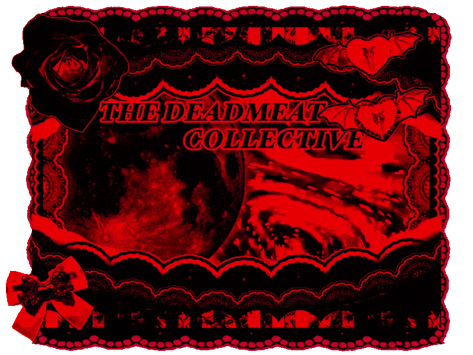

[easier to read ver](https://github.com/xdeadmeatcolx/easy2read.git)

  

         ⠀⠀ ⠀⠀ ⠀⠀ ⠀⠀ ⠀⠀  
        

${{\color{#ff0000} ⠀⠀info ⠀⠀ ⠀✦ ⠀⠀ ⠀}}$

  
${{\color{#ff0000}in}}$ ${{\color{#740000}safe⠀server⠀,⠀sometimes⠀18+⠀server⠀if⠀interacting⠀less}}$ ⠀⠀ ⠀⠀ ⠀⠀ ⠀ 
${{\color{#ff0000}area}}$ ${{\color{#740000}changes⠀depending⠀on⠀fandom/fronter⠀,⠀above⠀market⠀if⠀alone}}$ 
${{\color{#ff0000}frqing}}$ ${{\color{#740000}after⠀interacting⠀is⠀encouraged}}$ ⠀⠀ ⠀⠀ ⠀⠀ ⠀ ⠀⠀ ⠀⠀ ⠀⠀ ⠀ ⠀⠀ ⠀⠀  ⠀ 
${{\color{#ff0000}we}}$ ${{\color{#740000}hide⠀freely⠀and⠀are⠀nonconfrontational}}$ ⠀⠀ ⠀⠀ ⠀⠀ ⠀ ⠀⠀ ⠀⠀ ⠀⠀ ⠀ ⠀ 
${{\color{#ff0000}usually}}$ ${{\color{#740000}offtab⠀but⠀we⠀disconnect⠀often⠀,⠀sometimes⠀slowreplies}}$ ⠀⠀ ⠀⠀  
${{\color{#ff0000}avoid}}$ ${{\color{#740000}interacting⠀if⠀-15⠀,⠀16+⠀preferred⠀please}}$ ⠀⠀ ⠀⠀ ⠀⠀ ⠀ ⠀⠀ ⠀⠀⠀ 
${{\color{#ff0000}dont}}$ ${{\color{#740000}care⠀if⠀anyone⠀takes⠀inspo⠀just⠀dont⠀fully⠀copy}}$ ⠀⠀ ⠀⠀ ⠀⠀ ⠀ ⠀⠀    
${{\color{#ff0000}we}}$ ${{\color{#740000}are⠀always⠀friendly⠀and⠀free⠀to⠀interact⠀unless⠀said⠀otherwise!}}$ ⠀⠀
        
 

   ${{\color{#ff0000}fict⠀=⠀fictionally⠀sourced⠀alters⠀skin}}$ ⠀⠀ ⠀⠀ ⠀⠀ ⠀ 
  ${{\color{#ff0000}me⠀=⠀irl⠀or⠀specific⠀alters⠀skin}}$ ⠀⠀ ⠀⠀ ⠀⠀⠀ ⠀ ⠀⠀  
  ${{\color{#ff0000}cos⠀=⠀character⠀hyperfix⠀cosplay⠀skin}}$ ⠀⠀ ⠀⠀ ⠀⠀ 
  ${{\color{#ff0000}f/o⠀=⠀fictional⠀other⠀cosplay⠀skin}}$ ⠀⠀ ⠀⠀ ⠀⠀ ⠀⠀ 
   
   
   
⠀⠀⠀⠀ ${{\color{#740000}cool⠀pt⠀players}}$ ${{\color{#ff0000}⌒}}$  
HELLHOUND<3 , [@EXPL0RE-EXPRESS-UNITED-INC](https://github.com/EXPL0RE-EXPRESS-UNITED-INC) 
${{\color{#ff0000}ask⠀to⠀be⠀added⠀if⠀friended!}}$ 
  

  <a href="https://github.com/kittinan/spotify-github-profile">
    
